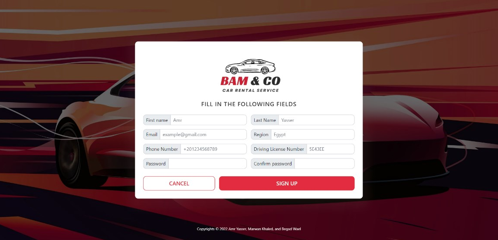
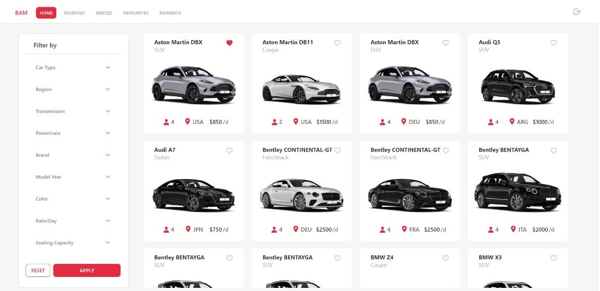
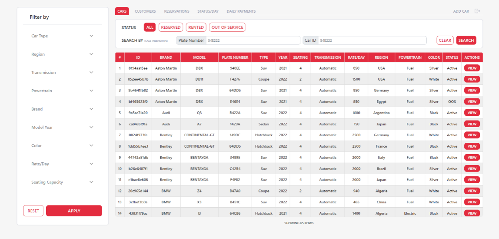
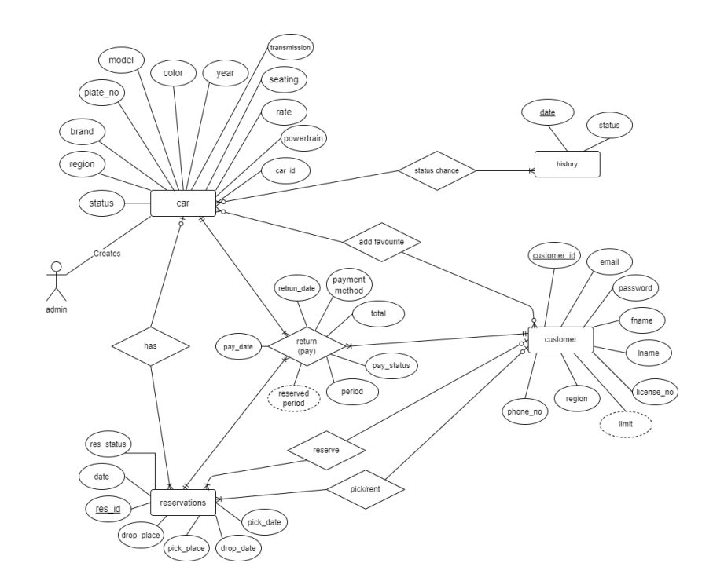
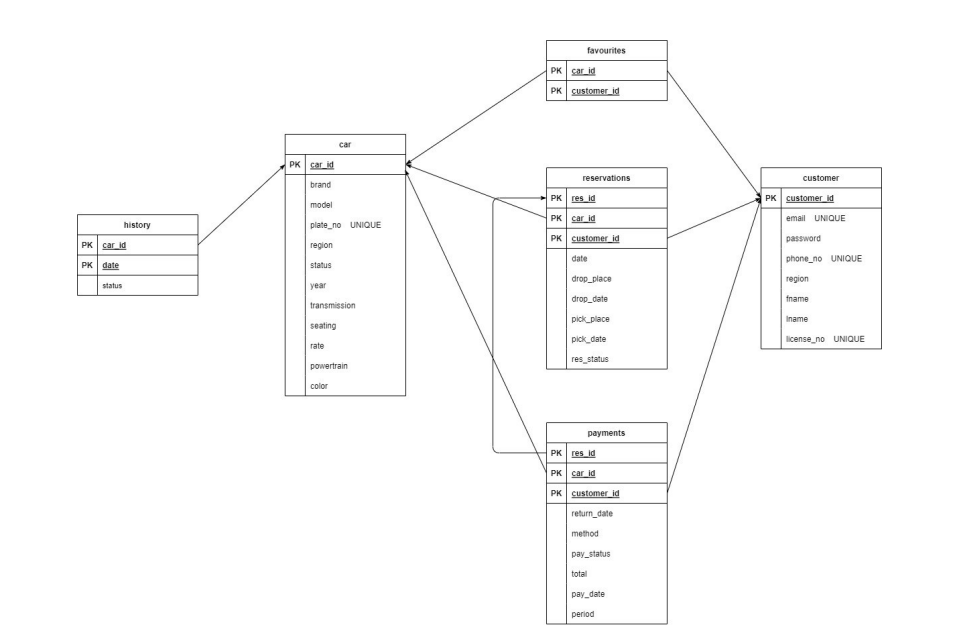

# 🚗 Automotive Rental Managment System Using Node.Js🚗

This project is a comprehensive car rental solution built using Node.js. The system provides a platform for managing all aspects of car rentals, from the reservation process to the administration of car inventory and customer information.

With a user-friendly interface and real-time updates, the application makes it easy for users to search for available cars and make reservations. The admin panel, on the other hand, gives the user full control over the rental process and provides a comprehensive interface for managing the car inventory, rental transactions, and customer information.

## Key Features 🔑
* User-friendly interface for car rental management 💻
* Admin panel for managing cars, rental transactions, and customer information 🚀
* Search and reservation system for available cars 🔎
* Real-time updates on car availability and rental status 🕒

## Demo 🎥
> Photos displyed below shows website in action

 Sign-up | Registration page

 User home page

Admin cars page

## System Design 🛠️

>The ERD provides a visual representation of the relationships between the various entities, such as customers, vehicles, and rental transactions, in the system. The data mapping, on the other hand, defines how data is stored in the database and how it will be used by different components of the system. Together, the ERD and data mapping provide a comprehensive overview of the system architecture and data flow, ensuring a well-designed and efficient car rental system.

                  

 

ERD model

 

ERD model Mapping

## Table of contents :label:

| File Name | Description                                                                                      |
|-----------|--------------------------------------------------------------------------------------------------|
| [Src](https://github.com/XMaroRadoX/automotive-rental-managment-system-using-node/tree/main/website/src) | Contains Source code of the project           |
| [db](https://github.com/XMaroRadoX/automotive-rental-managment-system-using-node/tree/main/website/db)   | Contians database configuration and sample data|
| [package.json](https://github.com/XMaroRadoX/automotive-rental-managment-system-using-node/blob/main/package.json)| contains the metadata information about the project and its dependencies. |

### Pre-requisites :screwdriver:

* Database client preferable to use mysql 💾
* Node (v18.12.1) or above 💻

### APIs 🔌
* Imagine Studio 🎨
* Mailcheck 📧
* Restcountries 🌎

### Run :green_circle:

* Clone the repository to your local machine :computer::arrow_down:
* Run command: `npm install `:package:
* Run command: `npm run build`:hammer_and_wrench:
* Open MySQL and create a new database called car_rental_system :floppy_disk:
* In the newly created database, import the SQL file called car_rental_system.sql, which 
can be found in …../website/db :file_folder:
* Open the .env file, and enter your MySQL password :key:
* In the .env file you can change the server port, if you do so, you are required to change 
it in the config.js file, which can be found in …./website/src/js and run the command: 
npm run build. :pencil2:
* Run command: `node server.js` :floppy_disk:
* Access the application at http://localhost:3000 in your browser. :globe_with_meridians:

### Licensing :pencil:

This code is licensed under the Apache 2.0 License.

### Authors :pen:

* [Marwan Radwan](https://github.com/XMaroRadoX)
* [Amr Yasser](https://github.com/AMR-21)
* [Begad Wael](https://github.com/Begad2)

### Contribution :clinking_glasses:

Feel free to contribute just make a pull request and do what you wish. 😼

